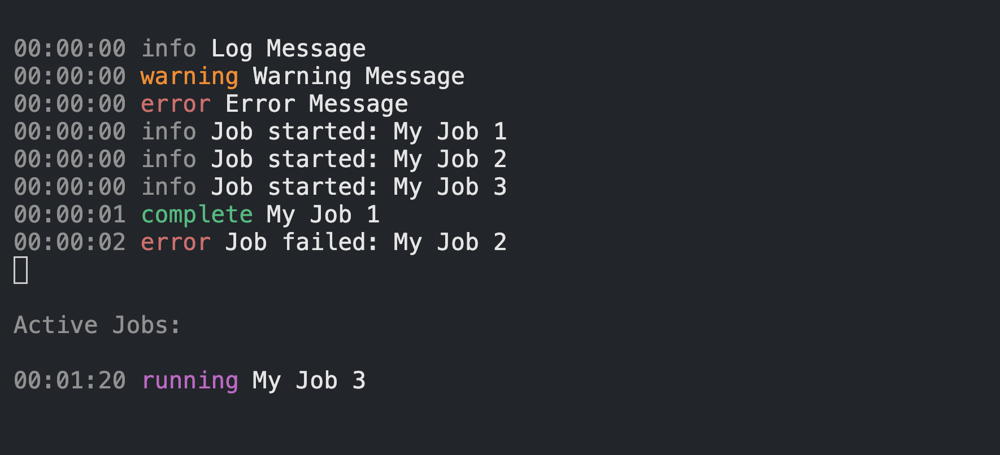

# Flame Logs

When you just want simple logs that look nice

## Features

Support for the following:

- log, info, warn, and error messages
- colors for each log level
- relative timestamps for each log message
- run and track jobs with configurable retries

## Example

```ts
import { FlameLogger } from "../src";

const flame = new FlameLogger({ clear: true })

flame.log('Log Message')
flame.logWarning('Warning Message')
flame.logError('Error Message')

const job1 = flame.startJob('My Job 1')
const job2 = flame.startJob('My Job 2')
const job3 = flame.startJob('My Job 3')

flame.completeJob(job1)
flame.failJob(job2)
```

